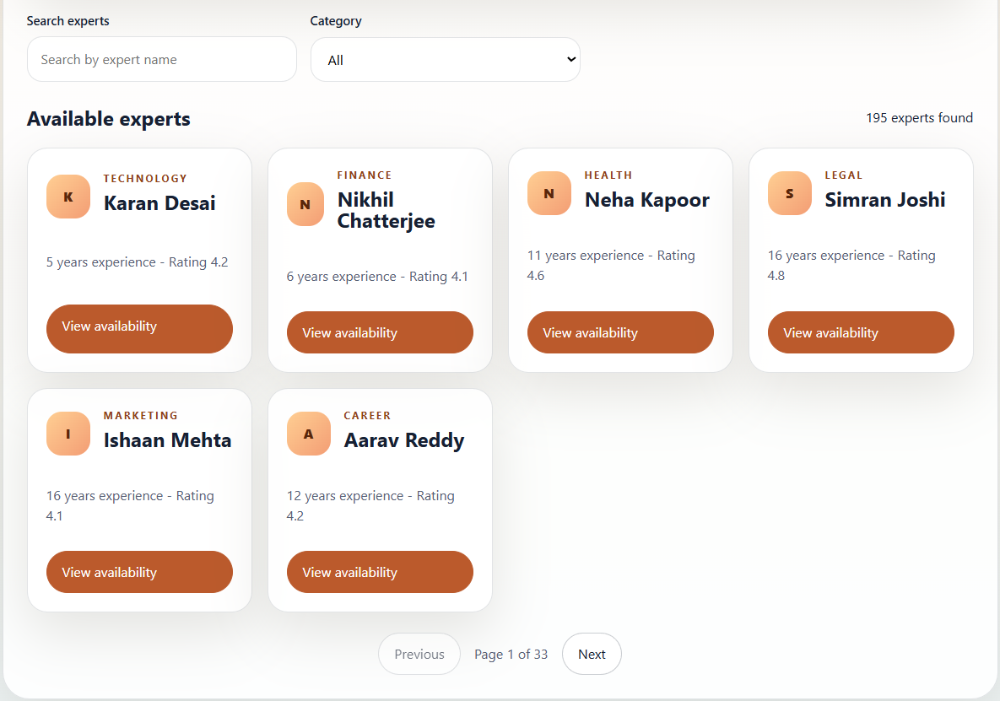
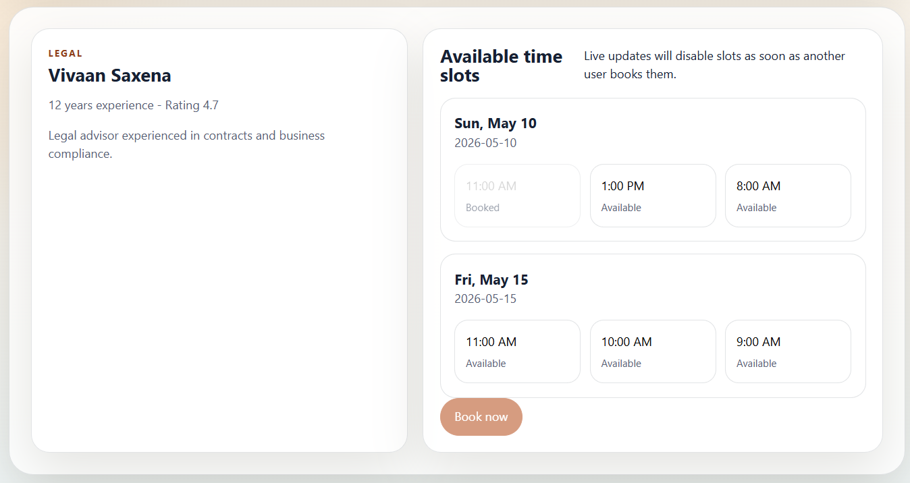
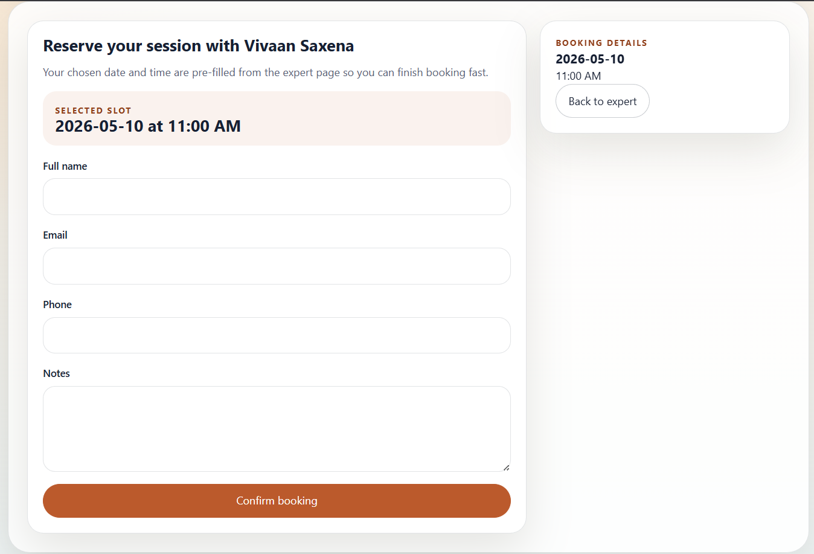
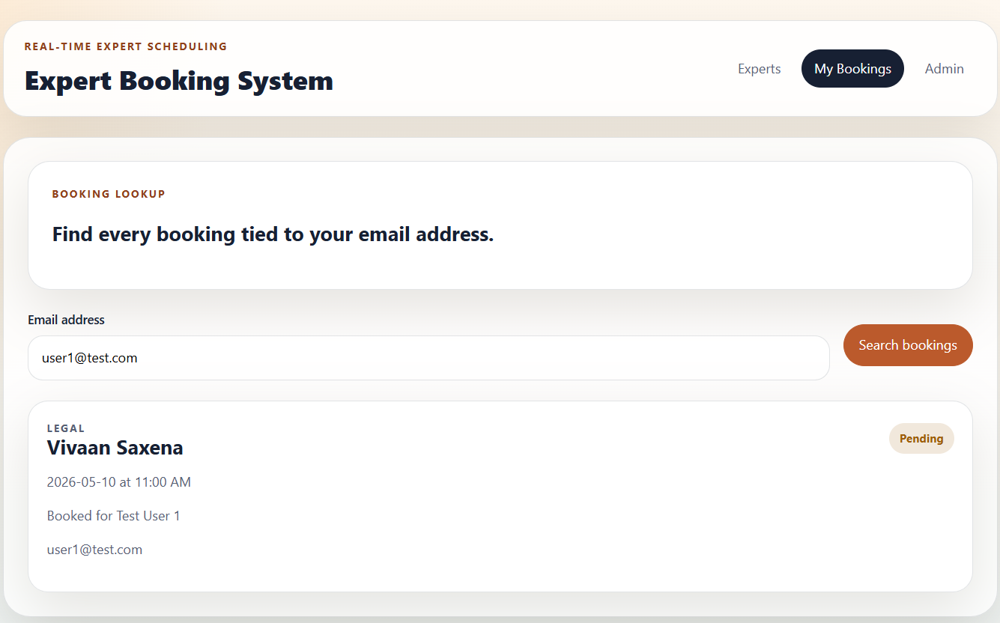
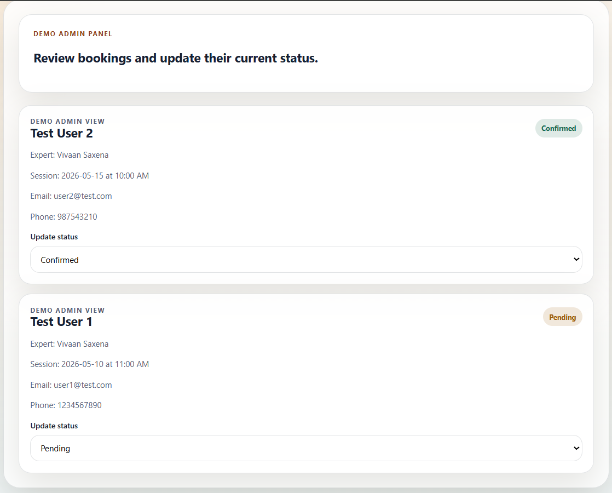

Expert Booking System
=====================

Real-time expert session booking platform built with React, Node.js, Express, MongoDB, and Socket.io. Supports live slot updates, race-condition-safe bookings, search/filter/pagination, booking management, and a lightweight mock admin view. Built as part of a full-stack assessment.

Live Demo
---------

-   Live URL: `https://gotoguys.vercel.app`

-   Video Demo: `https://your-video-demo-link.com`

* * * * *

Features
--------

### Expert Listing

-   Search experts by name

-   Filter by category

-   URL-synced pagination

-   Loading & error states

-   Responsive card layout

### Expert Detail

-   Available slots grouped by date

-   Real-time slot updates using Socket.io

-   Live slot disable/re-enable behavior

### Booking Flow

-   Booking form with validation

-   Race-condition-safe booking creation

-   Success modal after booking

-   Prevents duplicate bookings

### My Bookings

-   Lookup bookings by email

-   Status tracking:

    -   Pending

    -   Confirmed

    -   Completed

    -   Cancelled

### Mock Admin View

-   View all bookings

-   Update booking statuses

-   Live synchronization across clients

* * * * *

Tech Stack
==========

## Tech Stack

### Frontend


### Backend


* * * * *

Folder Structure
----------------

```
client/
server/
README.md

```

### Frontend Highlights

```
client/src/
├── components/
├── pages/
├── hooks/
├── services/
├── context/
├── utils/

```

### Backend Highlights

```
server/src/
├── controllers/
├── models/
├── routes/
├── middlewares/
├── socket/
├── utils/

```

Detailed structure available in `structure.md`.

* * * * *

Scalability Considerations
--------------------------

-   Compound unique MongoDB index prevents double booking

-   Socket.io-based realtime synchronization

-   React Query cache invalidation for lightweight sync

-   Centralized API services

-   Modular backend architecture

-   Environment variable support

-   Validation on both client and server

* * * * *

API Endpoints
-------------

### Experts

```
GET /api/experts?page=&limit=&category=&search=
GET /api/experts/:id

```

### Bookings

```
POST /api/bookings
GET /api/bookings?email=
GET /api/bookings
PATCH /api/bookings/:id/status

```

* * * * *

Local Setup
-----------

### 1\. Clone Repository

```
git clone https://github.com/devrittik/expert-booking-system
cd expert-booking-system

```

### 2\. Backend Setup

```
cd server
npm install
npm run dev

```

Create `.env`:

```
PORT=5000
MONGO_URI=your_mongodb_uri    ## Local or Cloud
CLIENT_URL=http://localhost:5173

```

### 3\. Frontend Setup

```
cd client
npm install
npm run dev

```

Create `.env`:

```
VITE_API_URL=http://localhost:5000

```

* * * * *

Cloudflare Tunnel Testing
-------------------------

Backend:

```
cloudflared tunnel --url http://localhost:5000

```

Frontend:

```
cloudflared tunnel --url http://localhost:5173

```

Update:

```
CLIENT_URL=<frontend-cloudflare-url>
VITE_API_URL=<backend-cloudflare-url>

```

* * * * *

Realtime Events
---------------

### Slot Booking

-   `slot:booked`

### Slot Release

-   `slot:released`

### Booking Status Updates

-   `booking:statusChanged`

* * * * *

Validation
----------

### Client + Server Validation

-   Name

-   Email

-   Phone

-   Expert ID

-   Date

-   Time Slot

`Notes` field remains optional.

* * * * *

## Screenshots

| Expert Listing | Expert Detail |
|---|---|
|  |  |

| Booking Page | My Bookings |
|---|---|
|  |  |

| Admin View | |
|---|---|
|  | |

* * * * *

## Author

**Rittik Chakraborty**

[](https://linkedin.com/in/rittik-chakraborty)
[](https://rittikchakraborty.vercel.app)
[](https://github.com/devrittik/)